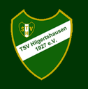

  

<h1 align="center">TSV Hilgertshausen – Festkasse</h1>

Ein einfaches, schnelles und offlinefähiges Kassensystem als Progressive Web App (PWA) für Vereinsveranstaltungen.

## Funktionen

- Offlinefähig
- Installation als App (Android & iPhone)
- Tischverwaltung
- Bestellungen erfassen
- Barzahlung mit Wechselgeldberechnung
- Übersicht offener Tische
- Datensicherung (Export / Import)
- Integrierte Feedback-Funktion

## Projektstatus

🚧 Das Projekt befindet sich aktuell in der aktiven Entwicklung.

Aktuelle Version: Alpha 3.3
